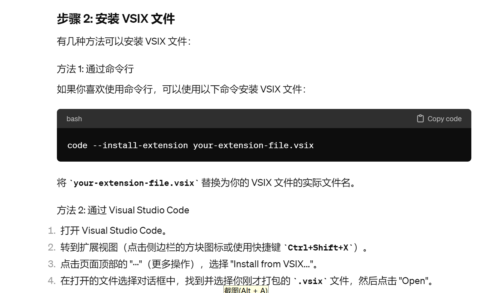

shaozeyv-auto readme
正文见尾
Debug Configuration Selector for VSCode

Description
This VSCode extension allows you to quickly select and activate debugging configurations directly from the keyboard, enhancing productivity by avoiding manual configuration selection through the debugging panel. It supports separate commands for launching C and C++ debug sessions, streamlining the development process for projects that involve frequent debugging.

Features
Quick Debug Activation: Activate C and C++ debugging configurations with predefined shortcuts.
Easy Configuration: Simplify the process of starting a debug session by binding shortcuts to specific debug configurations.

Installation
From VSIX
Download the .vsix file from the GitHub releases page.
Open Visual Studio Code.
Go to the Extensions view by clicking on the square icon on the sidebar or pressing Ctrl+Shift+X.
Click on the ... at the top right of the Extensions view, choose Install from VSIX..., and select the downloaded file.

Usage
After installation, you can use the following shortcuts to start debugging:

Ctrl+Alt+C (or Cmd+Alt+C on macOS) to start a C debug session.
Ctrl+Alt+D (or Cmd+Alt+D on macOS) to start a C++ debug session.

Ensure your launch.json is configured properly in your project to use these commands effectively.

Contributing
Contributions are welcome! If you'd like to improve this extension, please fork the repository and submit a pull request.

Release Notes
1.0.0
easy complete the task

License
This project is licensed under the MIT License - see the LICENSE.md file for details.

over
tnnd不让我用中文写readme是吧一写就给我报错？？

注意本扩展目前1.0.0仅支持gcc和g++的切换
用法如下
安装vsix压缩包，方法如图

新建工作目录
配置文件放到.vscode中（要改一下gcc，g++,gdb的路径）
over
此时
ctrl+alt+c用gcc编译后调试，ctrl+alt+d用g++编译后调试（没有断点的情况下相当于直接运行）